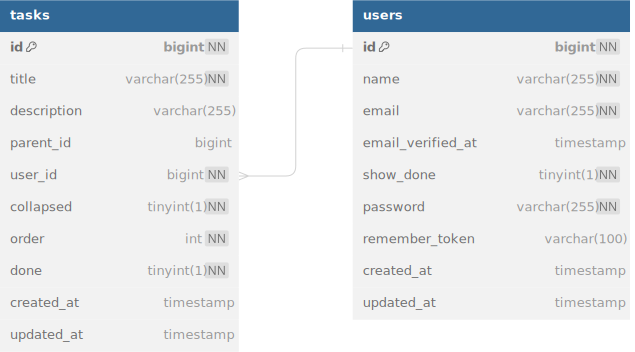

# To-Do App

## Описание проекта

To-do list со всеми основными возможностями: создание, редактирование, удаление, создание подзадач и изменение порядка задач.

## Установка и настройка

### Требования

-   PHP 8.2
-   Composer
-   Node.js & npm
-   MySQL

### Установка

> Если вы хотите использовать **Docker Compose**:
>
> 1.  Клонируйте репозиторий:
>
> ```bash
> git clone https://github.com/gyrovbogdan/to-do.git
> ```
>
> 2.  Перейдите в директорию проекта:
>
> ```bash
> cd to-do
> ```
>
> 3. Запустите контейнеры:
>
> ```bash
>    docker-compose up -d
> ```
>
> 4. Скопируйте файл `.env.example` в `.env`:
>
> ```bash
>   cp .env.example .env
> ```
>
> 5. Установите зависимости, и настройте Laravel с помощью скрипта run.sh:
>
> ```bash
>   docker exec my_dict_app bash ./to-do/docker/run.sh
> ```
>
> Сайт будет доступен по адресу `http://localhost:8080`

Для обычной установки следуйте следующей инструкции:

1. Клонируйте репозиторий:

    ```bash
    git clone https://github.com/gyrovbogdan/to-do.git
    ```

2. Перейдите в директорию проекта:

    ```bash
    cd to-do
    ```

3. Установите зависимости PHP с помощью Composer:

    ```bash
    composer install
    ```

4. Установите зависимости JavaScript с помощью npm:

    ```bash
    npm install
    ```

5. Скопируйте файл `.env.example` в `.env` и настройте его:

    ```bash
    cp .env.example .env
    ```

6. Сгенерируйте ключ приложения:

    ```bash
    php artisan key:generate
    ```

7. Настройте базу данных и выполните миграции:

    ```bash
    php artisan migrate
    ```

8. Запустите сервер разработки:
    ```bash
    php artisan serve
    ```

## Использование

После установки и запуска приложения перейдите по адресу `http://localhost:8000` в вашем браузере. Вы сможете увидеть главную страницу приложения, где отображется список задач для пользователя.

## Архитектура и структура проекта

### База данных



#### Основные сущности

-   **User** — Пользователь, который имеет личный список дел.
-   **Task** — Задача, имеет поля для описания: title, description и т.д. Задача поле parent_id, которое указывает на задачу родителя, таким образом образуя дерево задач. Если поле parent_id равно NULL, то значит задача корневая.

### Controllers

#### Api

-   **TaskController** — Контроллер для CRUD операций над задачами.

#### Web

-   **HomeController** — Контроллер для отображения домашней страницы

### Jquery Frontend

#### Для реализации всего спектра задач существуют следующие классы:

-   **EventManager** — Менеджер событый, главный класс, который отвечает за обработку событий и связывает между собой Api и DisplayManager.
-   **DisplayManager** — Meнеджер отображения, этот класс отвечает за создание и отображение задач.
-   **Api** — Класс, отвечающий за отправку ajax запросов.
-   **TaskTemplates** — Шаблоны задач, вспомогательный класс, который содержит шаблоны для отображения html кода задач, форм и т.д.

## Технологии

-   Laravel 11
-   jQuery 3.7
-   MySQL 8.4
-   Bootstrap 5

## Контакты

Если у вас есть вопросы или предложения, пожалуйста, свяжитесь со мной по адресу [gyrovbogdan@gmail.com](mailto:gyrovbogdan@gmail.com).
